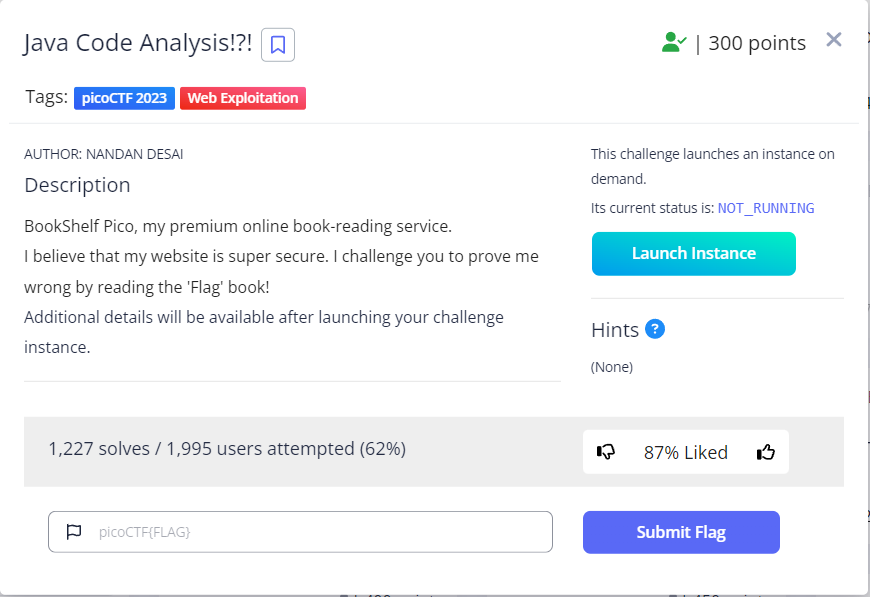
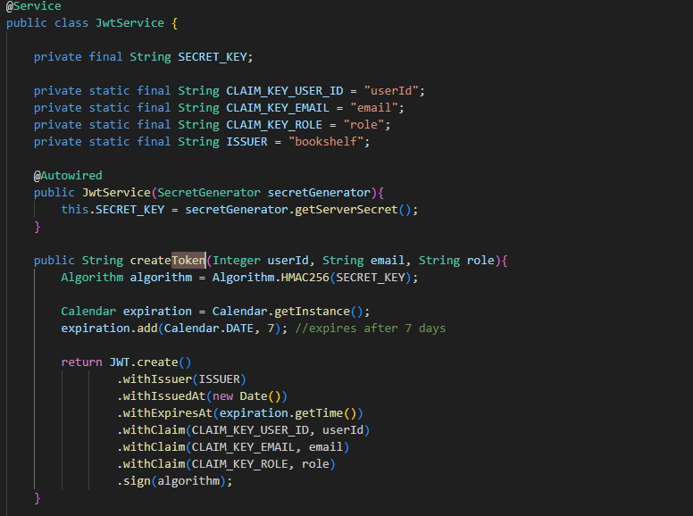
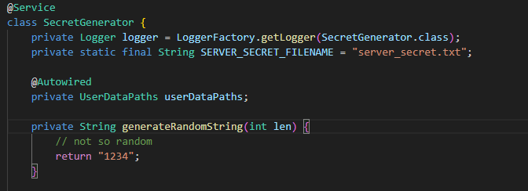
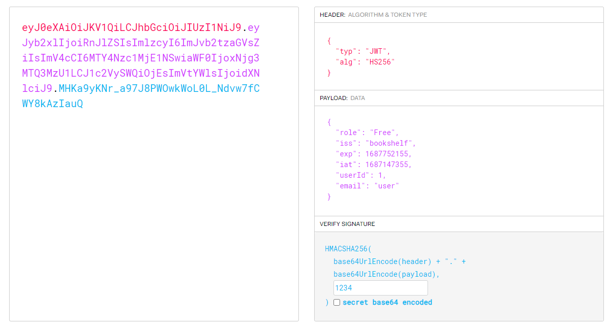
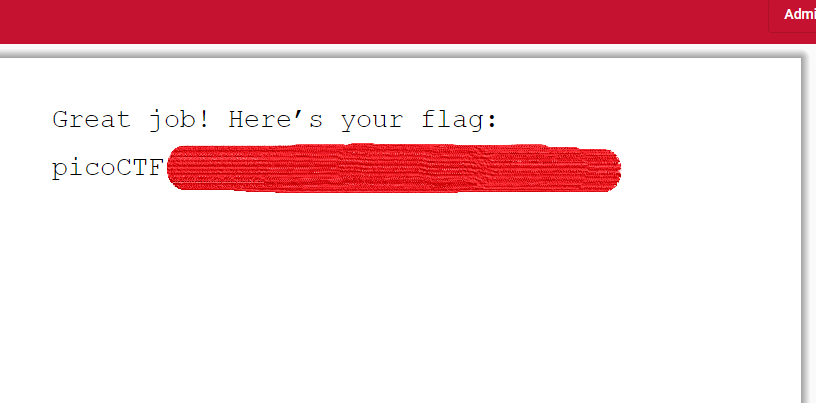

# Challenge:

# Solution:

Look at website after login with `user:user` , we can see the `auth-token` in Local Storage. Search for `token` in code we see some interesting function `JwtService.java` contain how the `SECRET_KEY` is generated.

Look around we saw another function call `SecretGenerator.java`, it appears that it first attempts to read the key from a local file `server_secret.txt`, but if the file doesn’t exist, then it instead uses a hardcoded `random` string of `1234` instead. This can be our secret key to decrypt the jwt.

Copy token from `auth-token` to jwt.io with pass

The error message told that we need to be admin to see the flag pdf. Then we search code again for the admin we get got something in `Role.java`. We will infer based on this comment and increment the userId field to 2.

In our recursive grep, we also see a line `.setEmail("admin")` so we will go ahead and set the email field to admin just in case this is needed as well.

We also already know from earlier that we should be able to use `1234` as the SECRET_KEY.

Change the `userID` to 2 and `role` to Admin

Replace the token to page and we got the flag

